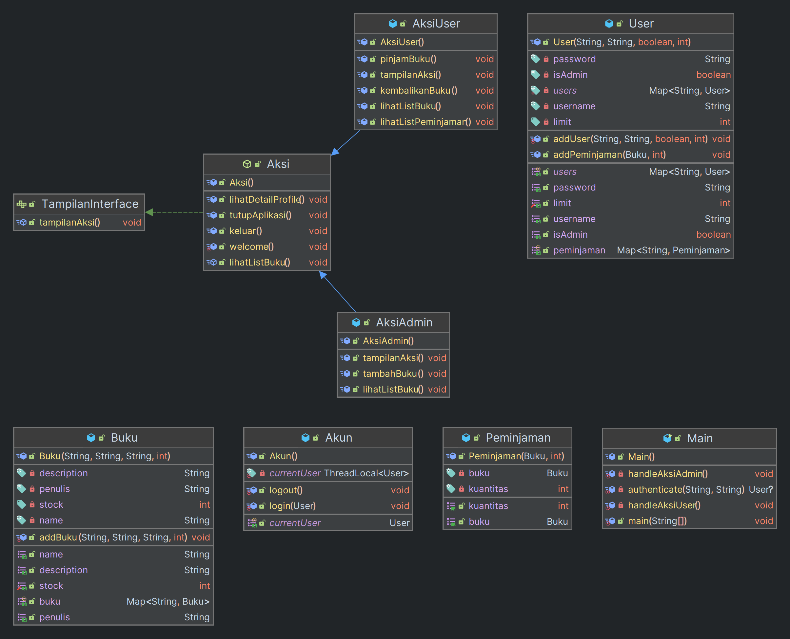

# Studi Kasus: Aplikasi Manajemen Buku Perpustakaan

## Deskripsi

Anda diminta untuk membuat sebuah aplikasi manajemen buku perpustakaan berbasis terminal. Aplikasi ini memiliki dua
peran utama: user dan admin. Berikut adalah rincian fitur yang harus ada dalam aplikasi:

## Fitur untuk kedua role (User Maupun Admin):

### 1. Login:

#### Semua akun dapat login ke dalam sistem menggunakan username dan password.

#### Ketentuan:

- Jika login berhasil, tampilkan pesan sambutan dengan nama user.
- Jika login gagal, tampilkan pesan kesalahan.

### Expected Output:

```text
Silakan login >_<
Username: user
Password: 123
Selamat datang user
```

```text
Silakan login >_<
Username: user
Password: 123456789
Username atau password salah. Silakan coba lagi.
```

### 2. Detail profile:

#### Semua akun dapat melihat detail profile mereka

#### Ketentuan:

- Tampilkan nama dari user tersebut.
- Tampilkan role dari user tersebut.
- Tampilkan limit peminjaman dari user tersebut

#### Expected Output:

```text
Halo user
Kamu adalah seorang User
Limit peminjaman kamu 10
```

### 3. Lihat Daftar Buku:

#### User dapat melihat daftar buku yang tersedia beserta deskripsinya.

#### Ketentuan:

- Tampilkan daftar buku beserta deskripsi, harga, dan stok yang tersedia.

#### Expected Output:

```text
Buku A - Deskripsi A - Penulis: Penulis A - Stok: 10
Buku B - Deskripsi B - Penulis: Penulis B - Stok: 5
```

### 4. Logout:

#### Semua akun dapat logout dari sistem.

#### Ketentuan:

- Tampilkan pesan logout.
- Setelah logout tampilkan menu awal.

#### Expected Output:

```text
Anda telah logout.
```

### 5. Tutup Aplikasi:

#### Semua akun dapat menutup aplikasi.

#### Ketentuan:

- Tampilkan pesan penutupan aplikasi.

#### Expected Output:

```text
Aplikasi ditutup.
```

## Fitur untuk User:

### 1. Pinjam Buku:

#### User dapat meminjam buku yang tersedia. User harus memasukkan jumlah buku yang ingin dipinjam.

#### Ketentuan:

- User memasukkan input nama buku yang ingin dipinjam lalu input total bukunya.
- Jika buku yang diinputkan tidak ada, maka tampilkan jika buku tidak ditemukan.
- Jika peminjaman berhasil, tampilkan pesan konfirmasi peminjaman.
- Jika stok tidak mencukupi tampilkan pesan kesalahan.
- Jika peminjaman melebih batas limit dari user tersebut, tampilkan pesan kesalahan.

#### Expected Output:

```text
Nama Buku yang ingin dipinjam: Buku A
Jumlah buku yang ingin dipinjam: 2
Buku berhasil dipinjam.
```

```text
Nama Buku yang ingin dipinjam: Buku C
Buku yang dicari tidak ditemukan.
```

```text
Nama Buku yang ingin dipinjam: Buku A
Jumlah buku yang ingin dipinjam: 20
Stok buku tidak mencukupi.
```

```text
Nama Buku yang ingin dipinjam: Buku A
Jumlah buku yang ingin dipinjam: 20
Gagal meminjam, kamu melebihi limit peminjaman pada akunmu.
```

### 2. Lihat Buku Yang Dipinjam:

#### User dapat melihat daftar buku yang sudah dipinjam sebelumnya.

#### Ketentuan:

- Tampilkan daftar buku yang dipinjam user beserta jumlah buku yang dipinjam.
- Tampilkan pesan jika user belum melakukan peminjaman sama sekali.

### Expected Output:

```text
Buku: Buku A - Jumlah: 2
```

```text
Kamu belum pernah melakukan peminjaman.
```

### 3. Kembalikan Buku yang dipinjam:

#### User dapat mengembalikan buku yang dipinjam sebelumnya.

#### Ketentuan:

- User memasukkan nama buku dan jumlah buku yang ingin dikembalikan.
- Jika buku yang diinputkan tidak ada dalam daftar peminjaman user, tampilkan pesan kesalahan.
- Jika jumlah buku yang dikembalikan melebihi jumlah yang dipinjam, tampilkan pesan kesalahan.
- Jika pengembalian berhasil, tampilkan pesan konfirmasi pengembalian.

### Expected Output:

```text
Nama Buku yang ingin dikembalikan: Buku A
Jumlah buku yang ingin dikembalikan: 1
Buku berhasil dikembalikan.
```

```text
Nama Buku yang ingin dikembalikan: Buku C
Buku yang ingin dikembalikan tidak ditemukan dalam daftar peminjaman.
```

```text
Nama Buku yang ingin dikembalikan: Buku A
Jumlah buku yang ingin dikembalikan: 3
Jumlah buku yang ingin dikembalikan melebihi jumlah yang dipinjam.
```

## Fitur untuk Admin:

### 1. Tambah Buku:

#### Admin dapat menambahkan buku baru ke dalam sistem dengan memasukkan nama buku, deskripsi singkat, harga tiket, dan stok tiket.

#### Ketentuan:

- Tampilkan pesan konfirmasi bahwa buku berhasil ditambahkan.
- Tampilkan pesan kesalahan jika nama buku sudah ada.

#### Expected Output:

```text
Nama Buku: Buku C
Deskripsi Buku: Deskripsi C
Penulis: Penulis C
Stok Buku: 15
Buku Buku C berhasil ditambahkan.
```

```text
Nama Buku: Buku C
Deskripsi Buku: Deskripsi C
Penulis: Penulis C
Stok Buku: 15
Buku Buku C sudah ada.
```

## Kriteria

- Sudah disediakan beberapa fitur dan method, silakan implementasikan fitur yang diminta pada method yang disedikan.
- Output tidak harus sama persis, namun ketentuan harus sesuai dengan yang diminta.
- Pengumpulan dalam bentuk ZIP dari project yang dibuat serta screenshot dari outputnya.
- Untuk screenshot adalah semua dari fitur yang diminta diatas dengan input sebebas kalian.

## Struktur Kelas

Diagram berikut menunjukkan struktur kelas yang saat ini digunakan dalam aplikasi ini:


